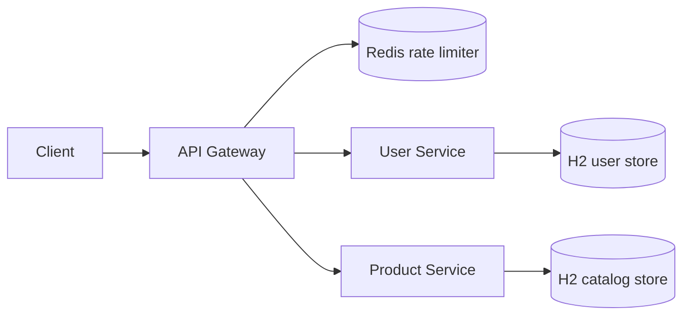

# API Gateway Security Platform

A production-style Spring Cloud Gateway platform that centralizes authentication, authorization, rate limiting, resilience, and request tracing for downstream ecommerce services.

This repository is intentionally structured as a small microservice system instead of a single demo endpoint. The gateway validates JWTs issued by the identity service, applies route-level access policies, forwards trusted identity headers, throttles traffic with Redis, and protects downstream services with circuit breakers.

## Services

- `api-gateway` - Spring Cloud Gateway edge service on port `8080`
- `user-service` - identity service with registration, login, JWT issuing, and user profile lookup on port `8082`
- `product-service` - persistent product catalog and inventory API on port `8081`
- `redis` - backing store for gateway request rate limiting

## Architecture



## Capabilities

- JWT issuing in `user-service` with configurable issuer, TTL, and shared signing secret
- Gateway-side JWT validation with issuer enforcement
- Route policies for public, authenticated, and admin-only endpoints
- Identity headers forwarded downstream as `X-User-Id`, `X-User-Email`, and `X-User-Roles`
- Redis-backed, identity-aware rate limiting with IP fallback for anonymous requests
- Resilience4j circuit breakers with structured fallback responses
- Correlation IDs propagated with `X-Correlation-Id`
- Persistent user and product models using Spring Data JPA and H2
- Product catalog, inventory adjustments, and soft discontinuation flows
- JSON error responses for auth, validation, and service failures
- Unit tests for gateway policies/JWT parsing, auth behavior, and catalog rules
- Maven aggregator build from the repository root

## Run Locally

Build the service jars:

```bash
mvn test
mvn -pl api-gateway,product-service,user-service -DskipTests package
```

Start the full stack:

```bash
docker compose up --build
```

Use a stronger local secret when needed:

```bash
$env:JWT_SECRET="replace-with-a-long-random-secret-of-at-least-32-bytes"
docker compose up --build
```

## Demo Accounts

The identity service seeds two local accounts:

| Email | Password | Roles |
| --- | --- | --- |
| `user@example.com` | `password123` | `USER` |
| `admin@example.com` | `admin12345` | `ADMIN` |

## API Flow

Login through the gateway:

```bash
curl -X POST http://localhost:8080/auth/login ^
  -H "Content-Type: application/json" ^
  -d "{\"email\":\"admin@example.com\",\"password\":\"admin12345\"}"
```

Copy the `accessToken` from the response and call protected endpoints:

```bash
curl http://localhost:8080/products ^
  -H "Authorization: Bearer <token>"
```

Create a product as an admin:

```bash
curl -X POST http://localhost:8080/products/admin ^
  -H "Authorization: Bearer <admin-token>" ^
  -H "Content-Type: application/json" ^
  -d "{\"sku\":\"SKU-CAMERA-004\",\"name\":\"Action Camera\",\"description\":\"Waterproof 4K camera.\",\"category\":\"Electronics\",\"price\":199.99,\"stockQuantity\":12,\"status\":\"ACTIVE\"}"
```

Adjust stock:

```bash
curl -X PATCH http://localhost:8080/products/admin/1/stock ^
  -H "Authorization: Bearer <admin-token>" ^
  -H "Content-Type: application/json" ^
  -d "{\"delta\":5}"
```

Get the current user:

```bash
curl http://localhost:8080/auth/me ^
  -H "Authorization: Bearer <token>"
```

## Route Policy

| Route | Access |
| --- | --- |
| `POST /auth/register` | Public |
| `POST /auth/login` | Public |
| `GET /auth/me` | `USER` or `ADMIN` |
| `GET /products/**` | `USER` or `ADMIN` |
| `/products/admin/**` | `ADMIN` only |
| `GET /actuator/health` | Public |

## Local URLs

- Gateway: `http://localhost:8080`
- Product service: `http://localhost:8081`
- User service: `http://localhost:8082`
- Gateway health: `http://localhost:8080/actuator/health`

## Test

```bash
mvn test
```

The test suite covers gateway authorization policy, JWT parsing, auth registration/login behavior, and catalog inventory rules.
